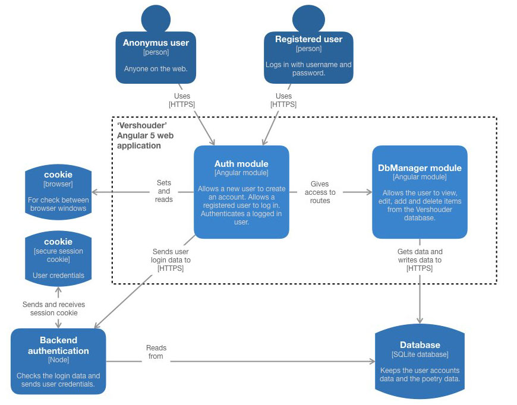
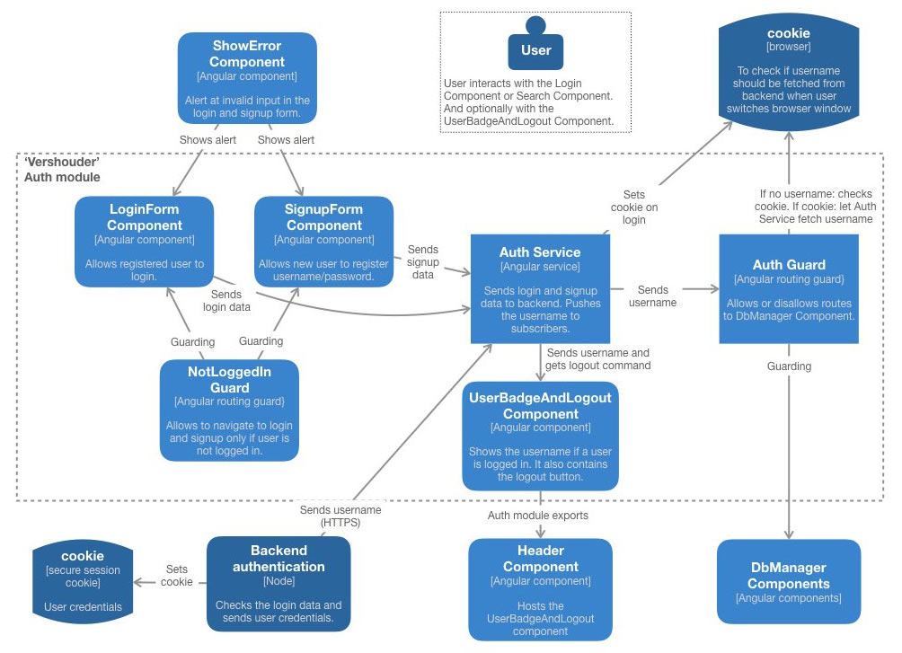
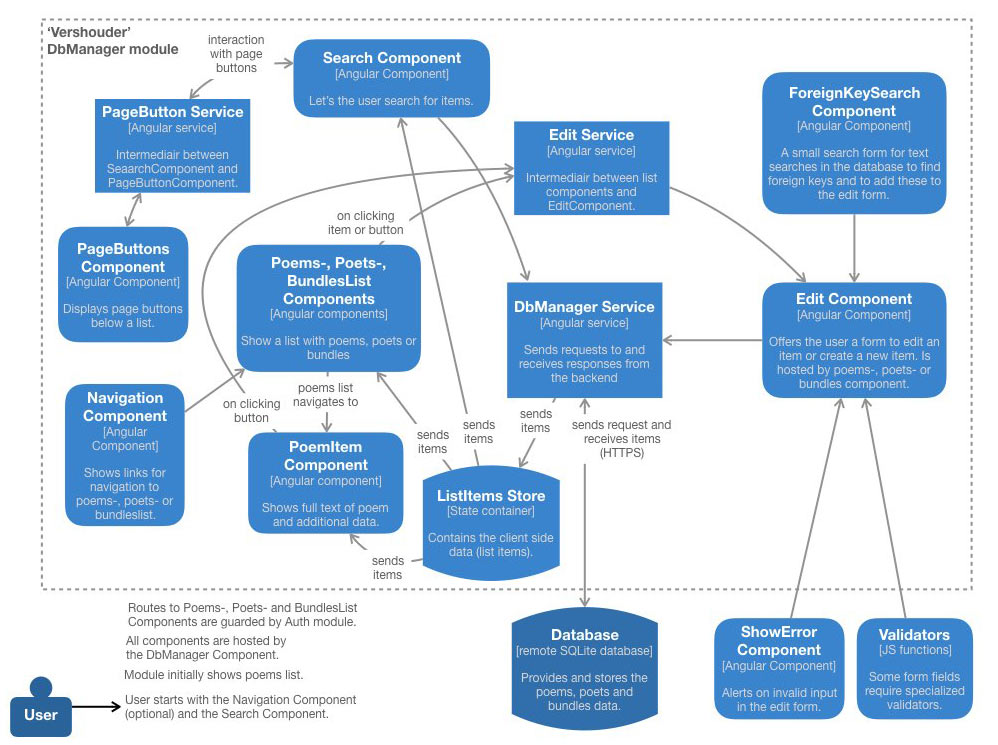

# Vershouder

This app manages a backend database with poems. If you are a not-registered user, you can create an account which allows you to see and edit a copy of the data.

The database has three tables: poems, poets and bundles (in Dutch: 'gedichten', 'dichters' and 'bundels').

This app is build to manage the data for a yet-to-build mobile app for displaying poetry.  

## Angular 

The app is made with Angular 5. The project was generated with [Angular CLI](https://github.com/angular/angular-cli) version 1.6.4.

## Development server

Run `ng serve` for a dev server. Navigate to `http://localhost:4200/`.

## Build

Run `ng build` to build the project. The build artifacts will be stored in the `dist/` directory. Use the `--prod` flag for a production build and the `--aot` flag for ahead-of-time compilation.

## Running unit tests

Run `ng test` to execute the unit tests via [Karma](https://karma-runner.github.io).

## App overview

**Global overview**

**Auth module**

Handles user authentication.

**DbManager module**

Shows the data to the user and allows editing and creating new data.

